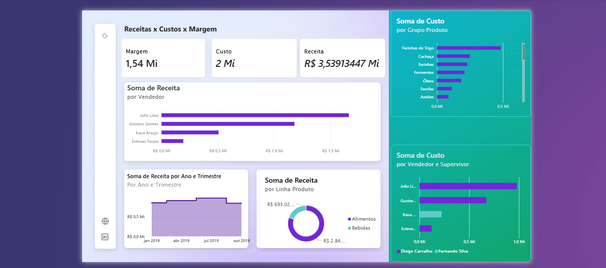
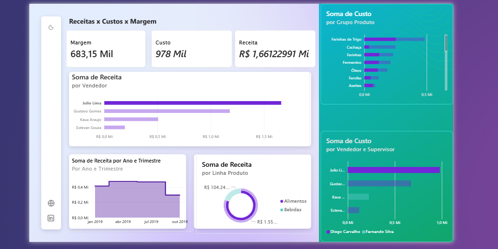

###
  

# Descrição 
Este painel financeiro comercial monitora o equilíbrio entre Receita, Custo e Margem. Ele é projetado para analisar a saúde financeira da operação, permitindo identificar quais vendedores são mais rentáveis, quais linhas de produtos consomem mais recursos e como a receita se comporta ao longo do tempo

# Tecnologias usadas
​Power bi, Power Query e DAX

# Principais insigns
Saúde Financeira (KPIs de Topo): A operação apresenta uma Margem de R$ 1,54 Milhão sobre uma Receita de R$ 3,54 Milhões. Isso representa uma margem bruta de aproximadamente 43,5%, o que é um indicador muito positivo de lucratividade.

​Disparidade de Performance entre Vendedores: Existe uma concentração de vendas muito forte no primeiro vendedor do gráfico. O faturamento dele é significativamente superior aos demais, o que sugere que o sucesso comercial da empresa depende muito de poucos indivíduos (risco de concentração de talentos).

​Estrutura de Custos por Categoria: O gráfico lateral de "Soma de Custo" revela quais grupos de produtos são mais caros para a operação. Identificar se esses grupos de alto custo também geram alta margem é crucial.

​Estabilidade de Receita: O gráfico de área (Ano e Trimestre) mostra uma receita relativamente estável com uma leve tendência de crescimento ou platô. Não há quedas bruscas, o que indica uma base de clientes fiel ou contratos recorrentes.

# Recomendação de negócios
 ​Auditoria de Custos: Como o custo total é de R$ 2 Milhões, recomendo uma análise profunda no grupo de produtos que lidera o gráfico de custos. Pequenas otimizações logísticas ou renegociações com fornecedores nessas categorias podem aumentar drasticamente a margem final.
 
​Plano de Incentivos e Treinamento: O "vendedor estrela" está carregando o resultado. É necessário realizar uma comparação de produtos das práticas desse vendedor e aplicá-las ao restante da equipe para elevar o nível médio e diminuir a dependência de uma só pessoa.

​Foco na Margem: Avalie se os vendedores que mais faturam são os que trazem a melhor margem. Às vezes, o vendedor que fatura menos vende produtos com margens maiores, sendo mais valioso para o lucro líquido.
